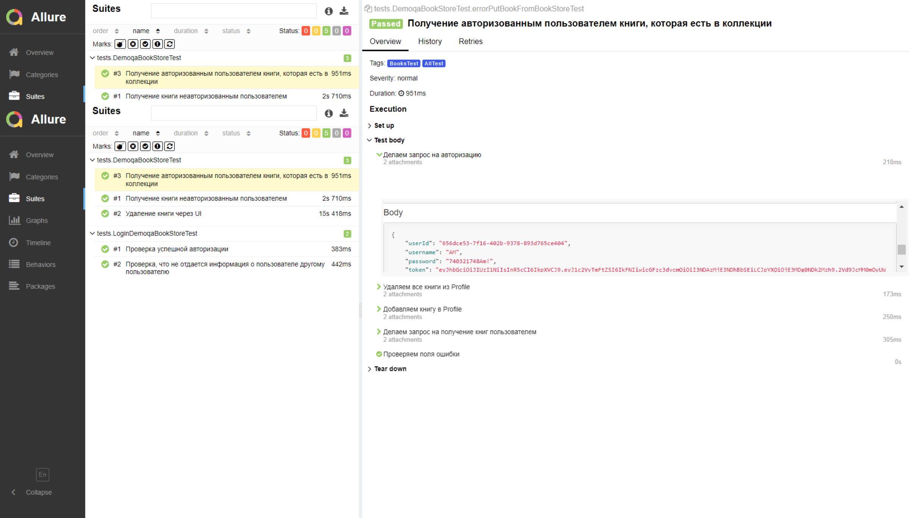
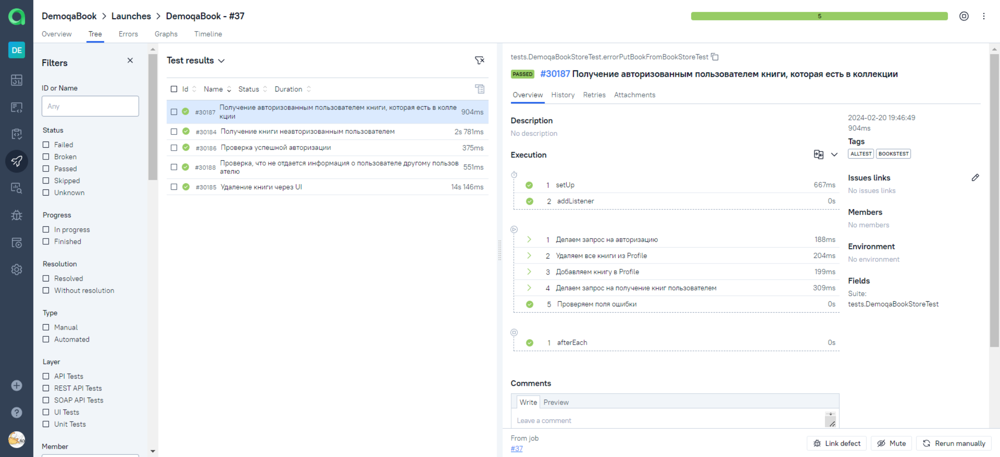
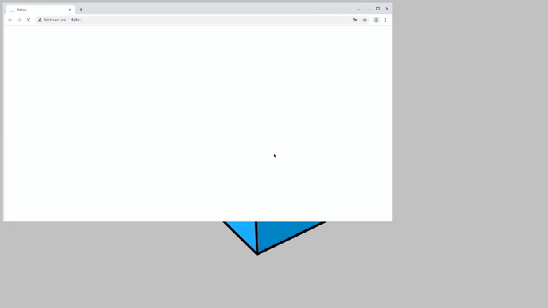

# Проект по автоматизации тестирования для DemoqaBook
DemoqaBook — тестовый сайт с несколькими разделами. Автоматизация выполнена для раздела Book Store Application.

##  Содержание:

- <a href="#tools"> Используемые инструменты</a>
- <a href="#cases"> Тест-кейсы</a>
- <a href="#autotests"> Запуск автотестов</a>
- <a href="#jenkins"> Сборка в Jenkins</a>
- <a href="#allureReport"> Пример Allure-отчета</a>
- <a href="#allure"> Интеграция с Allure TestOps</a>
- <a href="#video"> Видео примера запуска тестов в Selenoid для теста с UI</a>


____
<a id="tools"></a>
## Используемые инструменты

<p align="center">
<a href="https://www.java.com/"></a>
<a href="https://selenide.org/"></a>
<a href="https://aerokube.com/selenoid/"></a>
<a href="https://github.com/allure-framework/allure2"></a>
<a href="https://qameta.io/"></a>
<a href="https://gradle.org/"></a>
<a href="https://junit.org/junit5/"></a>
<a href="https://github.com/"></a>
<a href="https://www.jenkins.io/"></a>
</p>

____
Тесты написаны на языке <code>Java</code> с использованием фреймворка для автоматизации тестирования [Selenide](https://selenide.org/), сборщик - <code>Gradle</code>.

<code>JUnit 5</code> задействован в качестве фреймворка модульного тестирования.
При прогоне тестов для удаленного запуска используется [Selenoid](https://aerokube.com/selenoid/).

Для удаленного запуска реализована джоба в <code>Jenkins</code> с формированием Allure-отчета.
Также реализована интеграция с <code>Allure TestOps</code>.

Содержание Allure-отчета для каждого кейса:
* Шаги теста и результат их выполнения
* Request и Response.
* Для теста с UI:
    * Скриншот страницы на последнем шаге (возможность визуально проанализировать, почему упал тест)
    * Page Source (возможность открыть source страницы в новой вкладке и посмотреть причину падения теста)
    * Логи консоли браузера
    * Видео выполнения автотеста.
____
<a id="cases"></a>
## :male_detective: Тест-кейсы
Auto:
- ✓ Удаление книги через UI
- ✓ Получение авторизованным пользователем книги, которая есть в коллекции
- ✓ Получение книги неавторизованным пользователем
- ✓ Проверка успешной авторизации
- ✓ Проверка, что не отдается информация о пользователе другому пользователю

  <a id="autotests"></a>
____
## :arrow_forward: Запуск автотестов

### Запуск тестов из терминала

Локальный запуск.
Из корневой директории проекта выполнить:

Запуск всех тестов
```
gradle clean Test -Denv=local 
```
Запуск тестов проверок, связанных с книгами
```
gradle clean BooksTest -Denv=local  
```
Запуск тестов проверки с UI
```
gradle clean BooksTestWithUI -Denv=local 
```
Запуск тестов проверки авторизации
```
gradle clean LoginDemoqaBooksTest -Denv=local 
```
____
<a id="jenkins"></a>
##  Сборка в <a target="_blank" href="https://jenkins.autotests.cloud/job/DemoqaBook/"> Jenkins </a>
Для доступа в Jenkins необходима регистрация на ресурсе [Jenkins](https://jenkins.autotests.cloud/job/DemoqaBook/)

Для запуска сборки необходимо перейти в раздел <code>Build with parameters</code>, выбрать необходимые параметры и нажать кнопку <code>Build</code>.

###  Параметры сборки в Jenkins:
- TASK (набор тестов для запуска)
<p align="center">

</p>
<p>После выполнения сборки, в блоке <code>Build History</code> напротив номера сборки появятся значки <code>Allure Report</code> и <code>Allure TestOps</code>, при клике на которые откроется страница с сформированным html-отчетом и тестовой документацией соответственно.</p>

____
<a id="allureReport"></a>
##  Пример <a target="_blank" href="https://jenkins.autotests.cloud/job/DemoqaBook/allure/"> Allure-отчета </a>


<p align="center">

</p>

____
<a id="allure"></a>
##   Интеграция с <a target="_blank" href="https://allure.autotests.cloud/launch/35777/tree/586734"> Allure TestOps </a>

На *Dashboard* в <code>Allure TestOps</code> видна статистика количества тестов: сколько из них добавлены и проходятся вручную, сколько автоматизированы. Новые тесты, а так же результаты прогона приходят по интеграции при каждом запуске сборки.

<p align="center">

</p>

____
<a id="video"></a>
##  Видео примера запуска тестов в Selenoid

В отчетах Allure для каждого теста прикреплен не только скриншот, но и видео прохождения теста
<p align="center">
 
</p>

